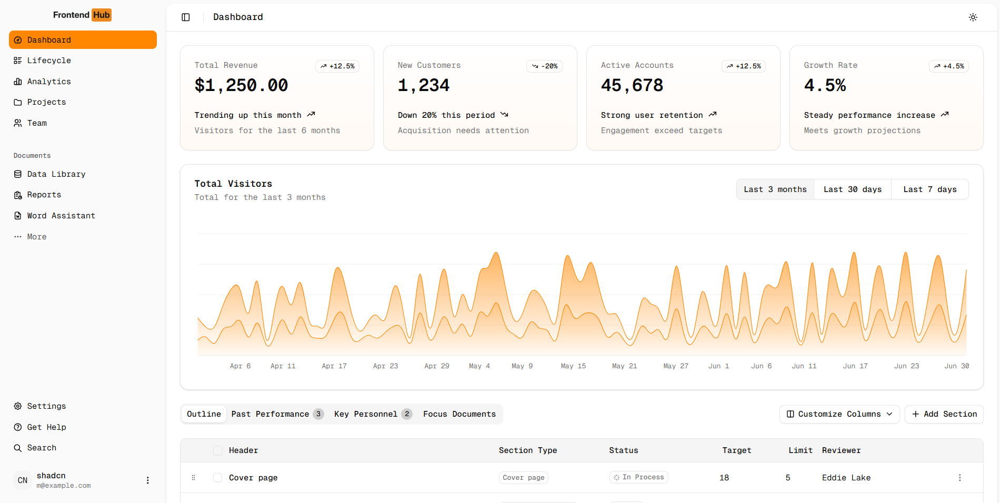
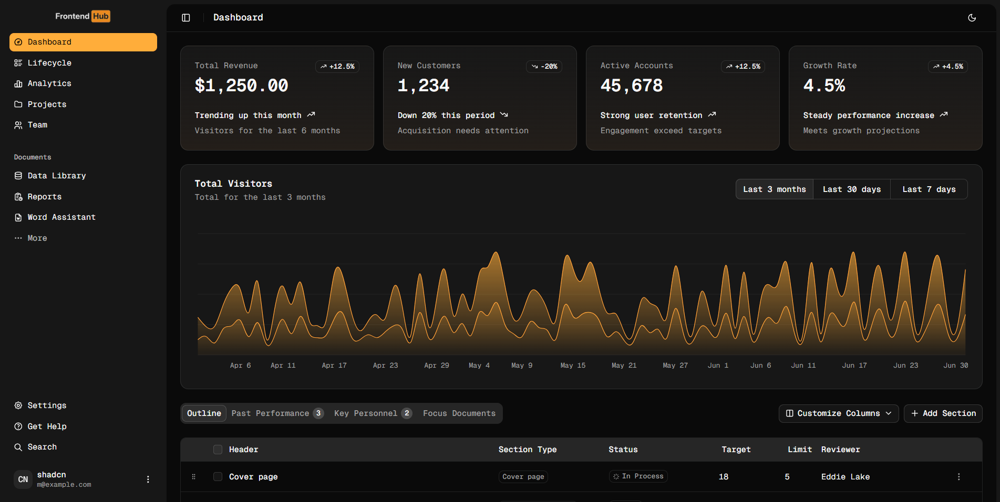

# Frontend Hub Dashboard

A modern, feature-rich dashboard application built with Next.js 15, TypeScript, and shadcn/ui components. This project provides a comprehensive dashboard interface with analytics, lifecycle management, data visualization, and more.




## ✨ Features

- 📊 **Interactive Analytics Dashboard** - Real-time data visualization with charts and metrics
- 🔄 **Lifecycle Management** - Track and manage different lifecycle stages
- 📋 **Data Tables** - Advanced data tables with sorting, filtering, and pagination
- 🎨 **Modern UI Components** - Built with shadcn/ui and Radix UI primitives
- 🌓 **Dark/Light Mode** - Theme switching with next-themes
- 📱 **Responsive Design** - Mobile-first approach with Tailwind CSS
- 🔐 **Authentication Pages** - Complete auth flow implementation
- 🎯 **Drag & Drop** - Interactive components with dnd-kit
- 📈 **Charts & Visualizations** - Powered by Recharts
- 🚀 **Performance Optimized** - Turbopack for fast development

## 🛠️ Tech Stack

### Core Framework
- **Next.js 15** - React framework with App Router
- **React 19** - Latest React with concurrent features
- **TypeScript 5** - Type-safe development
- **Tailwind CSS 4** - Utility-first CSS framework

### UI Components & Libraries
- **shadcn/ui** - Beautifully designed components
- **Radix UI** - Low-level UI primitives
- **Lucide React** - Beautiful & consistent icon set
- **Tabler Icons** - Additional icon library
- **class-variance-authority** - Component variant management
- **tailwind-merge** - Utility for merging Tailwind classes

### Data & State Management
- **TanStack React Table** - Powerful data tables
- **Zod** - Schema validation
- **Recharts** - Composable charting library

### Interactions & UX
- **DnD Kit** - Drag and drop functionality
- **next-themes** - Theme management
- **Sonner** - Toast notifications
- **Vaul** - Drawer component
- **NextJS TopLoader** - Page loading indicator

### Development Tools
- **ESLint** - Code linting
- **PostCSS** - CSS processing
- **Vercel Analytics** - Performance monitoring

## 📁 Project Structure

```
├── app/                    # Next.js App Router
│   ├── (auth)/            # Authentication pages
│   ├── (dashboard)/       # Dashboard pages
│   │   ├── analytics/     # Analytics dashboard
│   │   ├── dashboard/     # Main dashboard
│   │   └── lifecycle/     # Lifecycle management
│   ├── globals.css        # Global styles
│   ├── layout.tsx         # Root layout
│   └── page.tsx           # Home page
├── components/            # React components
│   ├── ui/               # shadcn/ui components
│   ├── analytics/        # Analytics components
│   ├── nav-*.tsx         # Navigation components
│   ├── data-table.tsx    # Data table component
│   ├── lifecycle-*.tsx   # Lifecycle components
│   └── chart-*.tsx       # Chart components
├── hooks/                # Custom React hooks
├── lib/                  # Utility functions
│   ├── constants/        # Application constants
│   └── utils.ts          # Utility functions
├── public/               # Static assets
└── components.json       # shadcn/ui configuration
```

## 🚀 Getting Started

### Prerequisites

- Node.js 18+ 
- npm, yarn, pnpm, or bun

### Installation

1. **Clone the repository**
   ```bash
   git clone https://github.com/makara4code/next-shadcn-dashboard.git
   cd next-shadcn-dashboard
   ```

2. **Install dependencies**
   ```bash
   npm install
   # or
   yarn install
   # or
   pnpm install
   # or
   bun install
   ```

3. **Run the development server**
   ```bash
   npm run dev
   # or
   yarn dev
   # or
   pnpm dev
   # or
   bun dev
   ```

4. **Open your browser**
   
   Navigate to [http://localhost:3000](http://localhost:3000) to see the application.

## 🎨 Available Scripts

- `npm run dev` - Start development server with Turbopack
- `npm run build` - Build the application for production
- `npm run start` - Start the production server
- `npm run lint` - Run ESLint for code linting

## 🎨 Customization

### Adding New Components

This project uses shadcn/ui components. To add new components:

```bash
npx shadcn@latest add [component-name]
```

### Theming

The application supports dark/light mode switching. Customize themes in:
- `app/globals.css` - CSS custom properties
- `components/theme-toggle.tsx` - Theme switching logic

### Styling

- Tailwind CSS classes for styling
- CSS custom properties for theme variables
- Component variants with class-variance-authority

## 📊 Dashboard Features

### Analytics Dashboard
- Interactive charts and visualizations
- Real-time data updates
- Responsive chart components

### Data Tables
- Advanced filtering and sorting
- Pagination support
- Drag and drop functionality
- Export capabilities

### Lifecycle Management
- Stage tracking and visualization
- Progress indicators
- Interactive lifecycle components

## 🤝 Contributing

1. Fork the repository
2. Create your feature branch (`git checkout -b feature/amazing-feature`)
3. Commit your changes (`git commit -m 'Add some amazing feature'`)
4. Push to the branch (`git push origin feature/amazing-feature`)
5. Open a Pull Request

## 📝 License

This project is licensed under the MIT License.

## 🔗 Links

- [Next.js Documentation](https://nextjs.org/docs)
- [shadcn/ui Documentation](https://ui.shadcn.com)
- [Tailwind CSS Documentation](https://tailwindcss.com/docs)